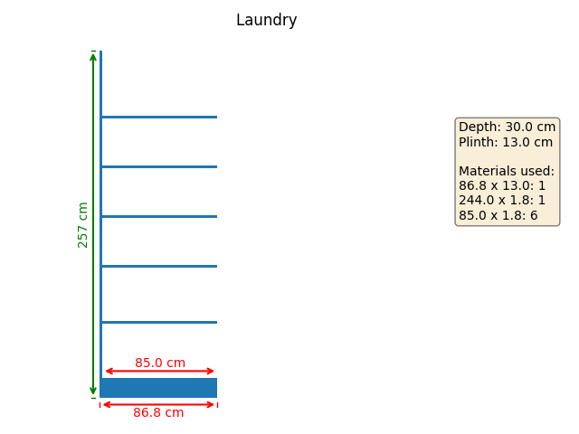
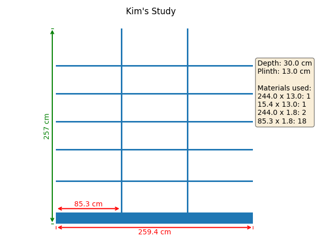
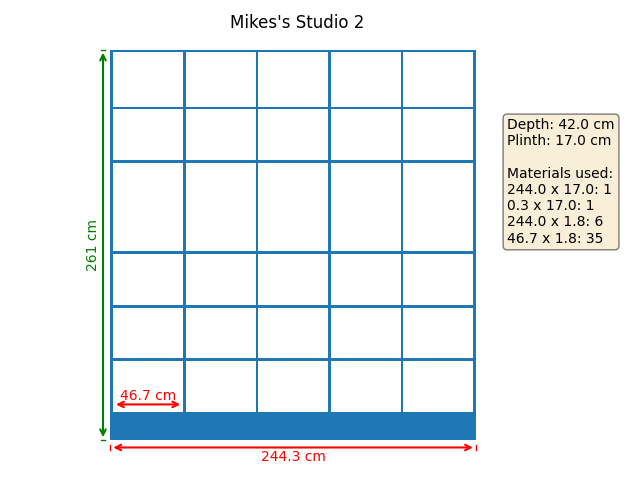

# Shelving Scripts
This script draws a number of shelving layouts, producing an image, dimensions and ordering materials list for each.

Call the main function with the various named parameters like this:

```
draw_bookcase(width=86.8, height=244+12.5, depth=30, shelf_heights=[40, 40, 35, 35, 35],
              edge_wd=2.4, lside_wd=2.4, rside_wd=0, uprt_wd=2.4, plin_ht=12.5, top_ht=0, divides=1, 
              title="Laundry ", fill=True, img_file='laundry')

draw_bookcase(width=259, height=244+12, depth=30, shelf_heights=[40, 40, 35, 35, 35],
              edge_wd=2.4, lside_wd=0, rside_wd=0, uprt_wd=2.4, plin_ht=12, top_ht=0, divides=3, 
              title="Kim's Study", fill=True, img_file='kim_study')

draw_bookcase(width=258.4, height=244+13, depth=21, shelf_heights=[38, 38, 35, 35, 35],
              edge_wd=2.4, lside_wd=2.4, rside_wd=2.4, uprt_wd=2.4, plin_ht=13, top_ht=2.4, divides=3, 
              title="Mikes's Studio 1", fill=True, img_file='mikes_studio1')

draw_bookcase(width=244.3, height=244+17, depth=42, shelf_heights=[34, 34, 34, 60.2, 27, 38],
              edge_wd=2.4, lside_wd=2.4, rside_wd=2.4, uprt_wd=2.4, plin_ht=17, top_ht=2.4, divides=5, 
              title="Mikes's Studio 2", fill=True, img_file='mikes_studio2')
```

## Example Images







